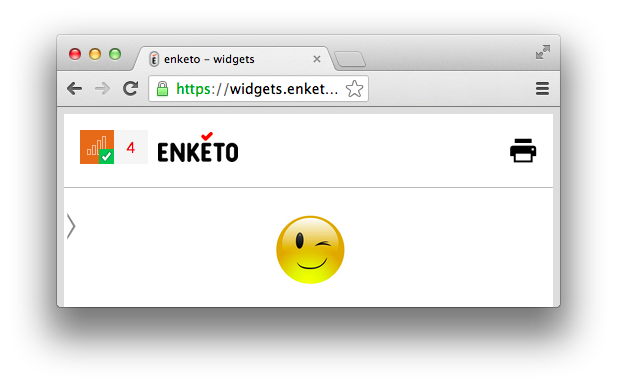

Enketo's user interface undergoes continuous improvements\*. Normally these are small and incremental. However, this week two major changes that are worth highlighting were deployed courtesy of Modi Labs.

###Offline-enabled?

Enketo is able to show different views of the same form. For example the formhub interface can show _previews_, _embedded forms_ and _forms to edit data_ in addition to the regular webform views. Not all of these views are offline-capable (i.e. able to _launch_ without an Internet Connection and able to save data _persistently_ inside the browser). In the old interface, the user was greeted with an 'Offline Capable!' alert the first time she/he loaded a form. The new interface has a much more elegant way of showing at all times whether a form view is offline-capable. It simply shows an icon at the top left of the form. The icon signifies that the form is succesfully 'installed' in the browser and ready for offline use. 

Clicking the icon will answer a much-asked question about what _offline-capable_ actually means.

###Uploading Records

The old interface was designed for the user to efficiently enter data, record after record, and not worry about uploading those records to the server. Uploads were handled in the background, automatically whenever a connection was available. The amount of records queued for submission were displayed as a number in a bubble right above the form. Enketo Smart Paper works offline and it was assumed that in the "normal situation", uploads would probably not succeed - due to the lack of an Internet connection - but that this would not be a problem. 

This worked well enough except when an issue prevented uploads from reaching the server, such as a bug or server downtime. In that situation, users would have no feedback on what was going wrong. They were also not able to verify easily whether Enketo was actually trying to upload. The queue number would simply refuse to reduce. Since queued records are stored inside the user's browser, there was also no way for developers to troubleshoot reported user issues.

The new interface changes all this by showing a side bar with a list of records and their upload status. The sidebar can be revealed by clicking the queue icon. When an upload is ongoing the border will turn orange. When it succeeds, it will turn green and then disappear from the queue. If an error occurs the record will turn red and an error message will be briefly shown underneath. The error message can be revealed and hidden at any time by clicking the record.

Uploads still happen automatically (every 5 minutes). However, if a user wants to force an upload in between these automatic attempts, she/he can now do so by clicking the upload button in the side bar. 

We think the new interface will go a long way in identifying any future upload issues that may occur. 

###Send your feedback!

As usual, both interface changes should work equally well on phones, tablets and lap/desktops. Please let us know if you notice issues on certain browsers or devices, or if you have ideas or questions to improve this further!

\* sometimes temporary regressions too…