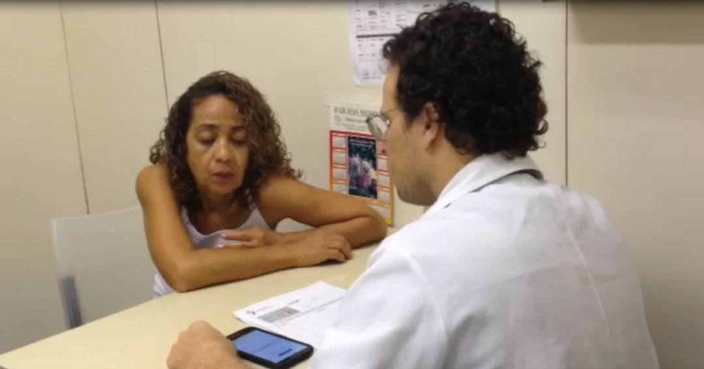

Using an innovative approach, Enketo is being used as a diagnostic tool in the fight against tuberculosis. In Brazil in 2013, 57 people in 100,000 had tuberculosis (TB) according to the World Health Organization. Complicating the picture, TB accounts for the majority of deaths in patients that also have HIV. Clearly, detection of TB is critical for health care providers at primary care facilities and hospitals. 

This is where Rafael Galliez comes into the picture. He currently works at [Universidade Federal do Rio de Janeiro](http://www.ufrj.br/) and also partners with a global network of TB researchers (Rede TB). As part of his Ph.D. work, Rafael wanted to see whether an algorithm to predict the risk of a patient at a hospital or primary care facility having contracted TB could be incorporated into a tool like Enketo.  Working under Afranio Kritski in the TB unit at the university, he developed and tested various diagnostic tools based on the algorithm. Graduate medical students also assisted with development. 

The search for the right technology to incorporate the algorithm and synchronize data collection within hospitals began three years ago. Because Brazil experiences internet connectivity issues, Rafael needed something that could also be used offline with a variety of devices such as iPhone and android phones and tablets. Last year, he began running his own [Formhub](https://github.com/SEL-Columbia/formhub/wiki/How-To-Run-Your-Own-Formhub-Instances-on-Amazon-Web-Services) server and his own [ODK Aggregate](https://opendatakit.org/use/aggregate/) server. Eventually, he settled on a service provided by [Ona](https://ona.io). Rafael realized that Enketo could be used to implement algorithms that would allow healthcare providers to quickly determine a patient’s risk of being infected with TB.

The algorithm consists of various questions about symptoms, risk factors, and results of diagnostic tests. Testing of the algorithm was initially conducted using paper forms created in Word, which ended in December. This February, Rafael plans on introducing [his Enketo webform](https://k6iut.enketo.org/webform) to nurses and doctors in primary care facilities. One of the goals of the project is to create a tool that nurses and medical students can use to quickly determine the appropriate treatment for a patient and whether the patient needs to be isolated. Doctors can then confirm the nurse’s or medical student’s diagnosis using the same tool.The Enketo webform is also being used to collect data for clinical research. 

Using an Enketo webform as a decision-making tool is a great use case that leverages the enormous power of the form format to create forms with complex skip logic. Rafael sees a future for developing these kinds of tools using other models and would like to collaborate with interested parties. He can be contacted at galliez77 @ gmail.com. 
