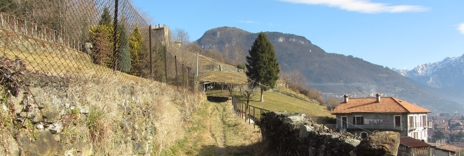
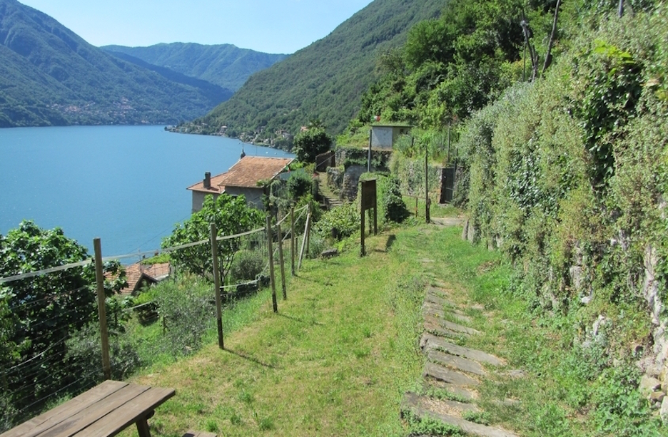

Using Enketo to connect with history on the Via Regina

Along the western coast of Lake Como in northern Italy sits an ancient road called Via Regina, or the Road of the Queen. Lake Como sits at the base of the Italian Alps and is a popular tourist destination. A little over a year ago, a community-funded project was started to increase awareness of the Via Regina. Marco Minghini began using Enketo to start a mapping project whose goal was to collect reports of damage to the Via Regina.

In Roman times, the Via Regina was a very important trade route, acting as a link between northern and southern Europe. Although it is called the Road of the Queen, the Via Regina is actually a network of pathways that climb into the Alps. Tourists can walk these pathways and explore history. The purpose of the Via Regina project is to link Swiss and Italian people in the area and increase awareness of history. The project itself is an international effort involving designers and planners.

Marco's project, which will be finished later this year, involves the collection of GIS data, pictures, and interesting notes about the pathways. To accomplish this, Marco organized [mapping parties](http://viaregina.como.polimi.it/mapparty/). In addition, he collaborated with high school students. The students spent 10-20 hours working with Marco's group on projects the students were interested in. Some of these students won first prize at the NASA World Wind European competition for creating an [application that connected PoliCrowd to a virtual globe](http://geomobile.como.polimi.it/policrowd2.0/). This is how Marco discovered Enketo.

Marco had already started working with ODK because his group uses primarily open source software. Most of the data on the map produced by the mapping parties was uploaded using Enketo. Although the public can't upload data to the map, they can access the [website](http://viaregina.como.polimi.it/mapparty/) and view uploaded information. Visitors to the site can click on the various icons to see pictures and drawings. Other icons contain descriptions of historic places or buildings along the pathways. Tourists can also click icons to obtain information about the location of signs, benches, and other tourist services. Eventually, Marco's group hopes to be able to create a geoportal with the data that links to the main map and a 3D presentation.
