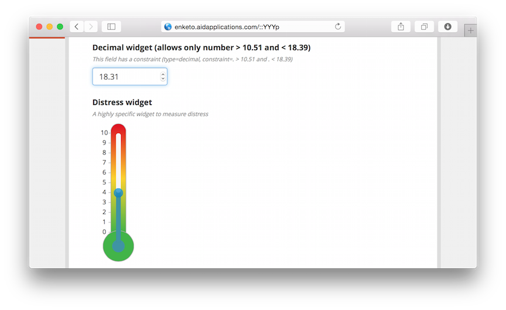
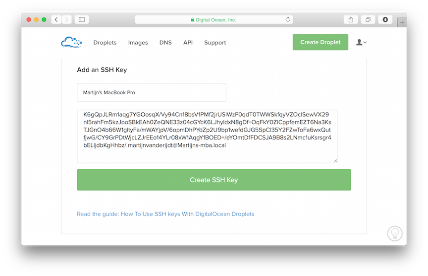
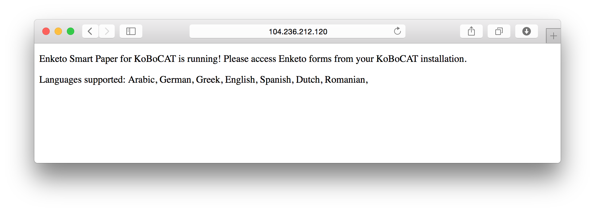
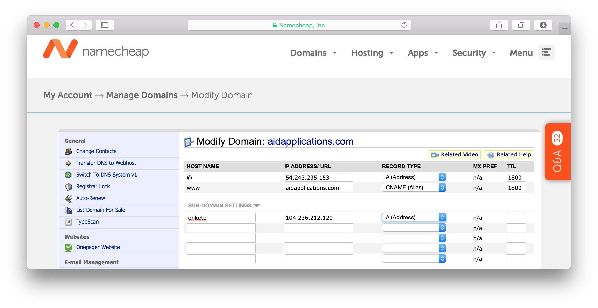
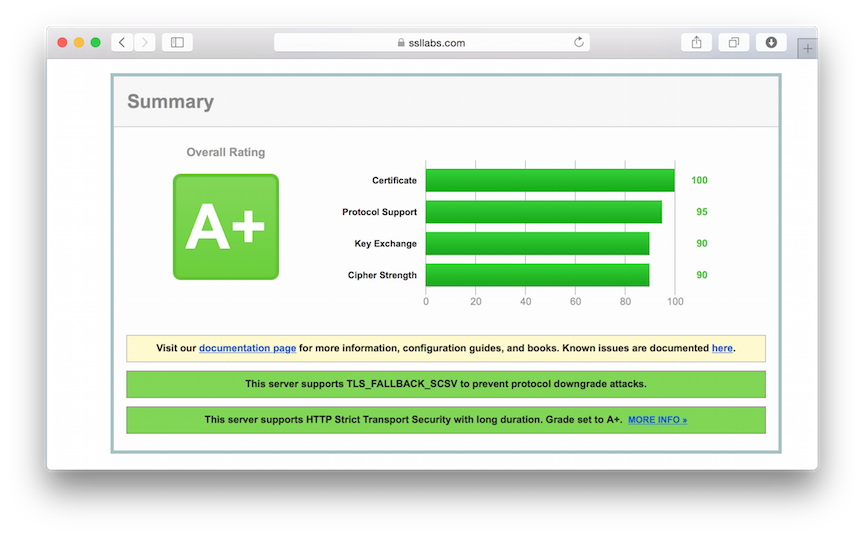
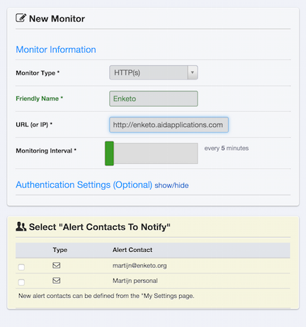

---
title: How To Install Enketo On Ubuntu 14.04
author: Martijn van de Rijdt
layout: post
permalink: /install-enketo-production-ubuntu
categories:
  - tutorial
tags:
  - enketo
  - ODK Aggregate

--- 

This post describes how to setup a secure _production server_ running Enketo for use with e.g. ODK Aggregate or KoBoCAT on [DigitalOcean](https://www.digitalocean.com/?refcode=9e43ccb8961a). It is meant to be a _living document_ that will continuously improve. Use the [forum](https://groups.google.com/forum/#!topic/enketo-users/XiTgHFll_nE) to discuss any issues or suggestions for improvement, or if you'd like to expand it with instructions for other hosting providers.



### 1. Considerations

**Installation is the easy part**. Maintaining a reliable server with close to **0% downtime** - especially when it becomes popular - is **a whole lot harder**. This document just provides a good starting point to launch a service, but does not help with running, troubleshooting and continuously updating your server. So before self-installing a production server, be prepared to spend a significant amount of time to run it afterwards.

Self-installation for most people is going to be **far more expensive** than using a public supported service, even if that service is not free. The time required to install and maintain a server and the "cost" of the likely longer periods of downtime will normally outweigh any fee you would pay for a provided service. **If cost is the primary argument to self-install, it is probably not the right decision.**

### 2. Create a public/private key pair 

To authenticate with the server we are going to use a public key, because this is more secure than using (just) a password. Make sure you backup your private and public key combo, so that you do not lose access to your server when your computer breaks down.

If you've already created a public/private key pair for your computer you can skip this step.

#### OS X or Linux Users

Use the following command in the terminal in **OS X or Linux**:

```bash
ssh-keygen -t rsa
```

The location of the keys is _~/.ssh_.

#### Windows Users

[Download PuTTY.exe and PuTTYgen.exe](http://www.putty.org/). PuTTYgen is only required once, so can be run from the Downloads folder. PuTTY is a program you'd want to keep, so should be put in e.g. a newly created C:\Program Files\PuTTY folder and added to the Windows Start Menu.

Run PuTTYgen.exe and click "Generate" with the defaults (SSH-2 RSA, 2048 bits). Move the mouse as directed. Passphrase is optional. Save the private and public keys both (e.g. in My Documents\Keys). Make sure to use clear filenames (e.g. private_key.ppk and public_key.ppk). Copy the contents of the public key from the PuTTY Key Generator window to the clipboard with Ctrl-C.

Make a note of the location of the keys as you'll need the keys soon. Also, make sure you have a backup of your keys!

#### More details:

More detailed instructions for OS X, Linux users can be found [here](https://www.digitalocean.com/community/tutorials/how-to-set-up-ssh-keys--2?refcode=9e43ccb8961a) (step 1 and 2 only) and for Windows users [here](https://docs.joyent.com/jpc/getting-started-with-your-joyent-cloud-account/generating-an-ssh-key/generating-an-ssh-key-manually/manually-generating-your-ssh-key-in-windows) (only the section "Generating an SSH Key").

### 3. Create a Server

For this tutorial, we are going to use Ubuntu 14.04 on a DigitalOcean server (aka a "droplet"). DigitalOcean provides the best bang for the buck when looking at CPU speed and CPU cores, both of which are the key criteria for Enketo Express performance. Their user interface is refreshingly well designed too. The tutorial should be quite similar for other VPS providers from section 4 onwards. If you do not have a DigitalOcean account yet, create one using [this referral link](https://www.digitalocean.com/?refcode=9e43ccb8961a) to get a $10 credit. 

#### Add your public key to your DigitalOcean account

In the DigitalOcean interface click on _Your Settings_ and go to the [security tab](https://cloud.digitalocean.com/settings/security?refcode=9e43ccb8961a). Click on _Add SSH Key_ and cut-and-paste your **public key** here. Do the same for any other users that will access your server.

[](https://cloud.digitalocean.com/settings/security?refcode=9e43ccb8961a)

Now, whenever you create a new server in DigitalOcean you can add any of these keys with the click of a button and will have immediate secure access via SSH, without a password!

When you buy a new computer you could just move your public and private key pair.

If multiple people/computers have (root) access to the server it is helpful to get the public key from all of them before you create your server, though you also add them to your server later using a different method.

#### Create a Droplet

Click the [Create Droplet](https://cloud.digitalocean.com/droplets/new?refcode=9e43ccb8961a) button at the top of the screen to create your server.

1. Give it a meaningful hostname, e.g. "enketo-production"
2. Select a size. The $10/month option is fine to start with, but when traffic becomes meaningful you'll probably quickly want to upgrade to the $20/month a plan because it has 2 CPU cores. Thankfully, upgrading can be done with the click of a button with only about 2-3 minutes downtime. The storage size is irrelevant for Enketo. When you upgrade you will have the (default) option to only upgrade RAM and CPU, or to upgrade storage size as well. It is usually best to choose the first because then you will be able to downgrade again later. **You cannot downgrade to a droplet with less storage than you currently have.** This allows you to easily try out different server sizes with little risk and little downtime. And because DigitalOcean bills per hour, the cost of trying out a different size is minimal too.
3. Select a region that is closest to the geographical center of where your users are located.
4. Select the _Ubuntu 14.04 x64_ image.
5. Click on the SSH key(s) that may be used to access the server.
6. Click _Create Droplet_ and wait until this is finished.

**Test**: In your [list of droplets](https://cloud.digitalocean.com/droplets?refcode=9e43ccb8961a) you will now see an IP address that was assigned to your server (e.g. 107.170.165.182). You should now be able to login to this server as "root". 

**OS X and Linux users**, try this out in the terminal with **your assigned IP address** as follows:

```bash
ssh root@107.170.165.182
```

**Windows users**, try this out by opening PuTTY, adding the IP address as Host Name, clicking on SSH and Auth in the left Category tree, and adding the private key. For detailed instructions see [this page](https://docs.joyent.com/jpc/getting-started-with-your-joyent-cloud-account/connecting-to-your-machine/connecting-to-your-machine-from-windows). Select 'Yes' when asked, and type 'root' when asked. After verifying that this works, you can save your session so you won't have to repeat these steps next time.

### 4. Server Installation

Login to your server as _root_ via SSH if you haven't done this already. You will probably never need to login as _root_ again after this, because we are going to create a new user now (and will actually block root access during this process).

#### Create a user

In these examples we'll create a user named "enketo" but you can use any other name. You will be prompted to enter a new password which you will need for configuring and updating your server (ie. for anything requiring `sudo` privileges). **Note: All the terminal snippets below assume you chose "enketo" as username.**

```bash
adduser enketo
```

To allow this user to login using your private key, we need to copy your public key (already added for root) to your new user account. 

```terminal
mkdir /home/enketo/.ssh
cp ~/.ssh/authorized_keys /home/enketo/.ssh
chown enketo:enketo /home/enketo/.ssh/authorized_keys
chmod 600 /home/enketo/.ssh/authorized_keys
```

To give this user sufficient privileges:

```bash
gpasswd -a enketo sudo
```

Configure ssh by disabling root access, and forcing public key authentication:

```bash
nano /etc/ssh/sshd_config
```

Scroll down with your keyboard arrow keys to find the existing settings and change their values to `no` as mentioned below. Remove the "# "in front of the sentence if present. These are the correct settings:

```bash
PermitRootLogin no
ChallengeResponseAuthentication no
PasswordAuthentication no
UsePAM no
```

Save your changes with CTRL+X, enter 'Y' to confirm, and then hit Enter

Now restart the SSH service and exit:

```bash
service ssh restart
exit
```

**Test**: You should now be able to login as 'enketo' (instead of 'root') without being asked for a password and have sudo privileges with a password.

OS X and Linux users (change the IP address):

```bash
ssh enketo@107.170.165.182
```

Windows users, do the same as before but enter user name 'enketo' when asked.

#### Install required software

Login via ssh as the user you created previously (**not as "root"**). Install the first batch of software packages as follows and enter 'Y' when asked to confirm:

```bash
sudo add-apt-repository -y ppa:rwky/redis
sudo apt-get update
sudo apt-get upgrade -y
sudo apt-get install -y git nginx htop build-essential redis-server checkinstall 
```

Install NodeJS 0.10.x and global Node packages

```bash
curl -sL https://deb.nodesource.com/setup_0.10 | sudo bash -
sudo apt-get install -y nodejs
sudo npm install -g grunt-cli bower pm2
```

Let Ubuntu automatically install security updates (select "Yes" when asked):

```bash
sudo dpkg-reconfigure -plow unattended-upgrades
```

### 5. Enketo Express Installation

Install Enketo Express and its dependencies.

```bash
cd ~
git clone https://github.com/enketo/enketo-express.git
cd enketo-express
git submodule update --init --recursive
bower install
sudo npm cache clean
npm install
```

### 6. Configuration

#### Database configuration

Configure 2 redis instances that run on different ports:

```bash
sudo service redis-server stop
sudo rm /var/lib/redis/redis.rdb

sudo mv /etc/redis/redis.conf /etc/redis/redis-origin.conf
sudo cp ~/enketo-express/setup/redis/conf/redis-enketo-main.conf /etc/redis/
sudo cp ~/enketo-express/setup/redis/conf/redis-enketo-cache.conf /etc/redis/

sudo mv /etc/init/redis-server.conf /etc/init/redis-server.conf.disabled
sudo cp ~/enketo-express/setup/redis/init/redis-server-enketo-main.conf /etc/init/
sudo cp ~/enketo-express/setup/redis/init/redis-server-enketo-cache.conf /etc/init/
```

Then, start the 2 redis instances:

```bash
sudo initctl reload-configuration
sudo service redis-server-enketo-main start
sudo service redis-server-enketo-cache start

```

**Test**: Cache database

```bash
redis-cli -p 6380
ping
exit
```

**Test**: Main database

```bash
redis-cli -p 6379
ping
exit
```

The response to both tests should be "PONG".

#### Enketo configuration

Create a configuration file by copying the default configuration:

```bash
cp ~/enketo-express/config/default-config.json ~/enketo-express/config/config.json
nano ~/enketo-express/config/config.json
```

The default configuration is almost functional. We just need to make sure it links to the correct Form/Data server and create a secret API key and encryption key. See [this document](https://github.com/enketo/enketo-express/blob/master/config/README.md) for an explanation of these configuration items. In this example we use a server at https://my-aggregate.appspot.com. So the minimum configuration items to change are:

```json
{
    ...
    "linked form and data server": {
        "name": "My Aggregate",
        "server url": "my-aggregate.appspot.com",
        "api key": "EERTIUCJSHDGKHD234325",
        ...
    },
    "encryption key": "a34sgfj324113413y",
    ...
}
```

Use Ctrl-X and enter "Y" to save the configuration.

Build:

```bash
cd ~/enketo-express
grunt
```

Further configuration could be done in step 14.

### 7. Automatic Enketo Launch and Restart

Enketo Express should now be functional.

**Test**: Launch Enketo

```bash
cd ~/enketo-express
npm start
```

In your browser visit the IP address of the server, and add port 8005. E.g. visit http://107.170.165.182:8005. You should see a page similar to the screenshot below.



To make sure Enketo will run automatically upon reboot and will restart itself if it fails, we configure pm2. First stop the server with CTRL-C.

```bash
cd ~/enketo-express
pm2 start app.js -n enketo
pm2 save
sudo pm2 startup ubuntu -u enketo

```

**Test**: OS X and Linux users can test the API response, using the linked server url and corresponding api key for a non-existing form called "test", by entering something like the following into a **new terminal window**:

```bash
curl --user EERTIUCJSHDGKHD234325: -d "server_url=https://my-aggregate.appspot.com&form_id=test" http://107.170.165.182:8005/api/v2/survey
```

You should see a JSON response like this:

```json
{
    "url": "http://104.236.212.120:8005/::YYYp",
    "code": 201
}
```

**Test**: To verify that Enketo starts automatically when the server reboots, you could reboot the server with:

```bash
sudo shutdown -r now
```

Then wait about 15 seconds and check that Enketo is running by visiting the URL in the browser as in the beginning of this section. Then SSH back into your server.

### 8. Domain setup

#### DNS Settings

If you have rented a domain name for your Enketo installation, we can configure the webserver. In this example we'll be using a subdomain: "enketo.aidapplications.com" but you can also use the main domain.

First create a DNS entry for your domain using the tools that your DNS registrar provides. If you haven't found a DNS registrar yet, you could use [NameCheap](http://www.namecheap.com/?aff=85649). Create an _"A" record_ that points to your IP address.



#### NGINX Configuration

Create a webserver configuration as follows:

```bash
sudo nano /etc/nginx/sites-available/enketo

```

Use the following temporary configuration to test whether the domain and webserver are working:

```json
server {
    listen 80;

    location / {
        proxy_pass  http://127.0.0.1:8005;
    }
}
```

Save the configuration with Ctrl-X and type "Y". 

Activate the new configuration:

```bash
sudo rm /etc/nginx/sites-enabled/default
sudo ln -s /etc/nginx/sites-available/enketo /etc/nginx/sites-enabled/enketo
sudo service nginx restart
```

**Test**: Go to your (sub)domain in the browser (e.g. http://enketo.aidapplications.com). You should be seeing the front page.


### 9. Install an SSL certificate

Nothing in this section is specific to Enketo. You can also use one of the [thousands of SSL-certificate-installation-tuturials on the web](https://www.google.com/webhp?#q=How+to+install+an+ssl+certificate+for+nginx+on+Ubuntu+14.04).

Purchase an SSL certificate for your (sub)domain somewhere. This should not cost more than [$10/year](https://www.namecheap.com/security/ssl-certificates/comodo/positivessl.aspx?aff=85649). You will be asked to provide a _"CSR"_. The recommended way of generating a CSR is to log in to your Enketo server and:

```bash
sudo mkdir /etc/nginx/ssl
sudo openssl genrsa -out /etc/nginx/ssl/enketo.key 2048
sudo openssl req -new -key /etc/nginx/ssl/enketo.key -out /etc/nginx/ssl/enketo.csr
```

Make sure to enter Country Name, State/Province, City/Locality, and Common Name. The Common Name is **very important**. In the example above the common name is _"enketo.aidapplications.com"_. 

To display the content of the newly created CSR in order to copy and paste it:

```bash
sudo cat /etc/nginx/ssl/enketo.csr
```

Once you have received your SSL certificate bundle (or have created one from the various files that were sent), copy this enketo-bundle.crt to the server into /etc/nginx/ssl. Then change the permissions:

```bash
sudo chmod 600 /etc/nginx/ssl/enketo-bundle.crt
```

Create a DHE parameter: (This could easily take half an hour!)

```bash
cd /etc/nginx/ssl
sudo openssl dhparam -out dhparam.pem 4096
```

Update your webserver configuration:

```bash
sudo nano /etc/nginx/sites-available/enketo
```

The following configuration works well. Make sure to change enketo.aidapplications.com to your domain and make sure the ssl certificate and key paths are correct.

```json
server {
    listen       80;
    server_name  enketo.aidapplications.com;
    return 307 https://$server_name$request_uri;
}
 
server {
    listen 443;
 
    ssl on;
    ssl_certificate /etc/nginx/ssl/enketo-bundle.crt;
    ssl_certificate_key /etc/nginx/ssl/enketo.key;
    server_name enketo.aidapplications.com;
 
    ssl_ciphers "ECDHE-RSA-AES256-GCM-SHA384:ECDHE-RSA-AES128-GCM-SHA256:DHE-RSA-AES256-GCM-SHA384:DHE-RSA-AES128-GCM-SHA256:ECDHE-RSA-AES256-SHA384:ECDHE-RSA-AES128-SHA256:ECDHE-RSA-AES256-SHA:ECDHE-RSA-AES128-SHA:DHE-RSA-AES256-SHA256:DHE-RSA-AES128-SHA256:DHE-RSA-AES256-SHA:DHE-RSA-AES128-SHA:ECDHE-RSA-DES-CBC3-SHA:EDH-RSA-DES-CBC3-SHA:AES256-GCM-SHA384:AES128-GCM-SHA256:AES256-SHA256:AES128-SHA256:AES256-SHA:AES128-SHA:DES-CBC3-SHA:HIGH:!aNULL:!eNULL:!EXPORT:!DES:!MD5:!PSK:!RC4";
 
    ssl_protocols TLSv1 TLSv1.1 TLSv1.2;
    ssl_session_cache shared:SSL:10m;
 
    ssl_stapling on;
    ssl_stapling_verify on;
    resolver 8.8.4.4 8.8.8.8 valid=300s;
    resolver_timeout 10s;
 
    ssl_prefer_server_ciphers on;
    ssl_dhparam /etc/nginx/ssl/dhparam.pem;
 
    add_header Strict-Transport-Security max-age=63072000;
    add_header X-Frame-Options DENY;
    add_header X-Content-Type-Options nosniff;
 
    location / {
        proxy_pass  http://127.0.0.1:8005;
        proxy_redirect off;
        proxy_set_header Host $host ;
        proxy_set_header X-Real-IP $remote_addr ;
        proxy_set_header X-Forwarded-For $proxy_add_x_forwarded_for ;
        proxy_set_header X-Forwarded-Proto https ;
    }
}
```

Restart the webserver and check if any errors are shown:

```bash
sudo service nginx restart
```

**Test**: Go to [SSLLabs.com](https://www.ssllabs.com/ssltest/) to test your SSL configuration. If all is done correctly you should get an A+.




### 10. Ban Rogue Users

Install fail2ban to reduce the disruption caused by bots continuously trying to break into your server:

```bash
sudo apt-get install -y fail2ban
sudo cp /etc/fail2ban/jail.conf /etc/fail2ban/jail.local
sudo service fail2ban restart
```

You can optionally [further tweak](https://www.digitalocean.com/community/tutorials/how-to-protect-ssh-with-fail2ban-on-ubuntu-12-04?refcode=9e43ccb8961a) fail2ban by editing the configuration (`sudo nano /etc/fail2ban/jail.local`). Make sure to restart it after editing.

### 11. Firewall Setup

The following sets up a firewall:

```bash
sudo apt-get install ufw
sudo ufw allow ssh
sudo ufw allow 80
sudo ufw allow 443
sudo ufw enable
sudo ufw status
```

Type "y" when asked to proceed with operation.

**Test**: You should now no longer be able to access enketo in your browser using the server's IP address and port.

### 12. Monitoring

A simple and very useful service to monitor uptime is [uptimerobot.com](https://uptimerobot.com). E.g. use a HTTP(s) monitor for https://enketo.aidapplications.com that checks every 5 minutes. Specify how you'd like to be alerted when the service is unresponsive.



To add: [monit and mmonit](https://mmonit.com/monit/) setup for advanced monitoring.

### 13. Backups

Only **one file** contains critical information that should be backed up. This is located at _/var/lib/redis/enketo-main.rdb_. Restoring can be done simply by stopping redis (`sudo service redis-server-enketo-main stop`), copying the backup file, and starting redis (`sudo service redis-server-enketo-main start`).

### 14. Final configuration

Go through each item in [this document](https://github.com/enketo/enketo-express/blob/master/config/README.md) to further configure your Enketo installation. Make sure to rebuild with `grunt` and `pm2 restart enketo` after saving your new configuration.
