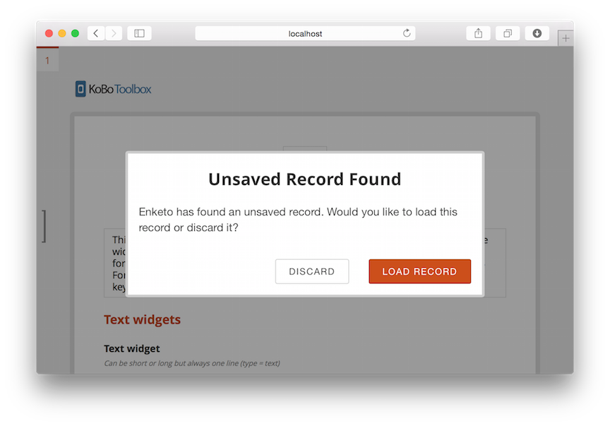

---
title: Auto-save
author: Martijn van de Rijdt
layout: post
permalink: /auto-save
categories:
  - Uncategorized
tags:
  - enketo
--- 

The [new Enketo](/enketo-express) now automatically saves your data in offline-capable webforms.

### How it works

Whenever a form value changes Enketo will update a special temporary record that is saved in a persistent browser database. Only after the user saves this record, the temporary record will be deleted. 

When Enketo loads a page it will check whether the special temporary record is present. If it is present, it will give the user the option to either load it or to remove it.

### How it benefits users

Whenever the user accidentally hits the Back button of a browser or mobile OS, accidentally refreshes the page, or experiences some other catastrophe, **the unsaved data will not be lost**. This is particularly important for large surveys where one could lose critical data that may have taken a long time to collect. 

This way of implementing Auto-Save was designed to minimize the annoyance of this feature and maximize the benefit to cover all possible scenarios, including an empty battery and a browser crash.

### Limitations

This feature only works for _un-saved_ records using _offline-capable_ webforms. This means that if you are editing a record that was previously saved as a draft, the auto-save feature will not be active.

### How to use it

Just use the latest version of Enketo Express and its offline-capable webform views.

### Sponsor

This auto-save feature was funded by the [Santa Fe Institute](http://www.santafe.edu) as part of a [collaboration](http://www.santafe.edu/news/item/gates-slums-announce/) between the Santa Fe Institute and [Shack/Slum Dwellers International](http://www.sdinet.org/). 


